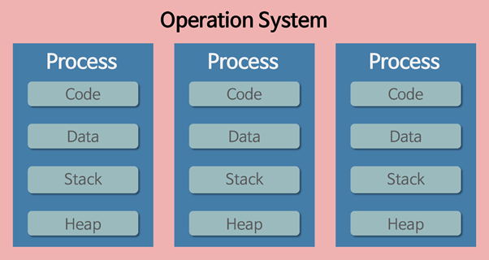

## 프로세스와 스레드의 차이

### 프로세스란?

프로그램이 실행되면서 운영체제가 할당한 작업의 단위

## 프로세스 주소 공간

프로세스는 OS로부터 메모리 영역을 할당받고, 4개의 영역으로 나눈다.

`Code 영역`

- 프로그램이 실행될 수 있도록 CPU가 해석 가능한 기계어 코드가 저장되어 있는 공간으로, 코드는 ReadOnly 상태로 저장되어있다.

`Data 영역`

- 전역변수나 정적 변수 등 프로그램이 실행될 때 저장되고, 프로그램이 종료될 때 해제된다.
- 전역 변수, 정적 변수를 참조한 코드는 컴파일 후 Data 영역의 주소값을 가리킨다.
- 실행 중 수정될 수 있기 때문에 Read-Write 상태로 지정되어 있다.

`Stack 영역`

- 높은 주소에서 낮은 주소로 데이터가 저장된다.
- 컴파일시 크기가 정해진다.
- 지역변수, 매개변수, 되돌아갈 주소값(임시데이터)들을 저장한다.
- Stack영역이 Heap영역을 침범할 때 / Stack영역을 벗어날 때 StackOverflow가 난다.
- 10만번째 피보나치 수를 구할 때, 임시데이터들을 스택 영역에 모두 저장해 놔야 하기 때문에 너무 많은 재귀함수를 호출하게 된다면 StackOverflow가 나는 것을 확인할 수 있다.

`Heap 영역`

- **동적 할당**(malloc(), new 등)을 위한 메모리 영역이다. 객체 생성시 할당된다.
- **런타임**(동적 할당의 경우)에 **크기가 정해진다**.
- 메모리의 높은 주소에서 낮은 주소의 방향으로 할당된다.
- 주로 객체가 저장되고 자바에서는 Garbage Collector 에 의해 정리된다.

### 스레드란?

프로세스가 운영체제로부터 할당받은 자원을 이용하는 실행의 단위.

프로세스 내에서 실제로 작업을 수행

모든 프로세스는 하나의 스레드를 가지는데, 이를 메인스레드라고 부른다.

### 흐름

프로그램이 실행되면 → 운영체제가 프로세스에 메모리 영역을 할당하고 → 프로세스는 한개 이상의 스레드를 생성해서 작업을 수행한다.

### 멀티프로세스

하나의 프로그램을 여러개의 프로세스로 구성하여 각 프로세스가 하나의 작업을 처리하게 하는 것

각 프로세스들은 다른 메모리 영역을 할당받고 작업이 진행되기 때문에 `안정성`이 좋다는 장점이 있다.

하지만, Context switching과정에서 캐시 메모리 초기화 등 비용 소모

- 캐시에 있는 모든 데이터를 리셋하고 다시 캐시정보를 불러와야 한다.

<aside>
💡 예시) 크롬

크롬은 탭이 하나 열릴 때마다 프로세스 개수가 늘어난다.

이는 예전 IE의 단점을 보완한 것으로, 하나의 탭이 죽어도 다른 탭에는 영향이 가지 않도록 설계한 것. (IE는 하나의 프로세스 안에서 멀티스레드 방식으로 탭들을 관리했다.)

독립적인 메모리 영역에서 작업을 하기 때문에 서로에게 영향이 가지 않는다.

</aside>

### 멀티스레드

- 멀티프로세스 환경보다 Context switching 비용이 적은 장점이 있다.
- 프로세스 내에서 자원들(Code,Data,Heap)을 공유하기 때문에 자원을 효율적으로 관리할 수 있다.
- 하지만, 한 스레드가 죽으면 다른 스레드들이 영향을 받기 때문에(프로세스의 자원을 공유하기 때문에) 프로그램 전체가 죽을 수 있다.
- 동기화문제, 데드락 또한 발생할 수 있어 개발자의 역량이 요구된다.
    - 데드락이란 스레드A와 스레드B가 각각 자원A, 자원B를 점유하고 있을 때 자원을 다 쓰고 다음 자원으로 넘어가려는데, 서로 점유하고 있는 상태를 풀 수 없어 무한로딩되는 상태

<aside>
💡 예시) 카카오톡

50MB짜리 사진을 보낸다고 칠 때(5분 소요 가정), 유저들은 5분동안 다른 작업을 할 수 있다.

사진을 보내는 동안 텍스트메시지를 보낼 수도 있다. 이는 멀티스레드 방식으로 각각의 작업들을 스레드로 나눠놓은 것이라 생각된다.

</aside>

### **멀티 프로세스 대신 멀티 스레드를 사용하는 이유?**

- 자원을 효율적으로 관리
    - 프로세스를 생성하여 자원을 할당하는 시스템 콜이 줄어들어 자원을 효율적으로 관리할 수 있다.

      → 프로세스 간의 Context Switching시 단순히 CPU 레지스터 교체 뿐만 아니라 RAM과 CPU 사이의 캐쉬 메모리에 대한 데이터까지 초기화되므로 오버헤드가 크기 때문

    - 스레드는 프로세스 내의 메모리를 공유하기 때문에 독립적인 프로세스와 달리 스레드 간 데이터를 주고 받는 것이 간단해지고 시스템 자원 소모가 줄어들게 된다.

<aside>
❓ 멀티프로세스와 멀티스레드 각각 장단점이 있기에 프로그램에 적합한 방식을 적용해야한다.

</aside>

### 스스로 질문

<aside>
❓ 이론상 작업속도가 가장 빠른 방법은 싱글프로세스 && 싱글스레드 환경인가? 
Context switching이 없기 때문에..?

</aside>
